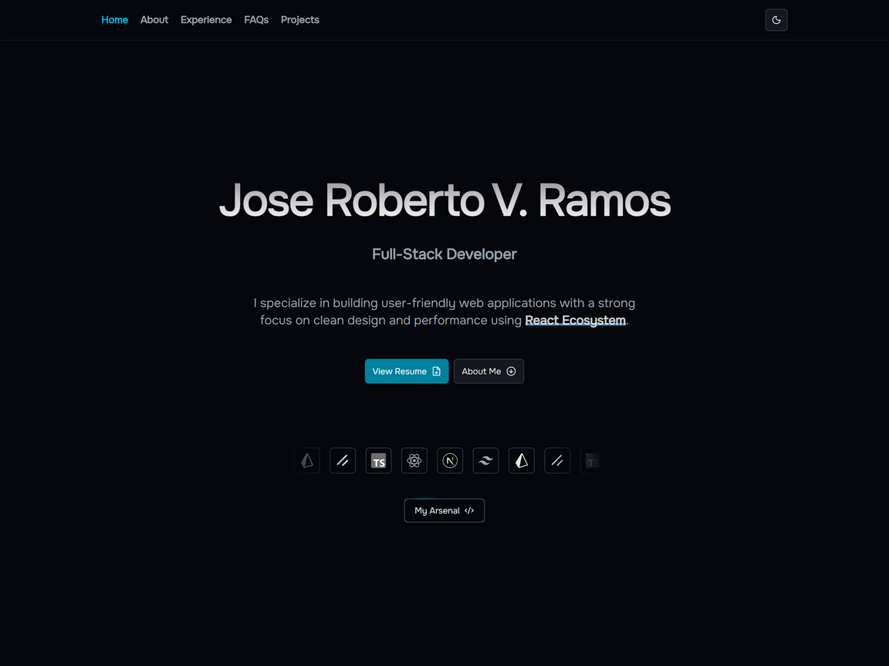
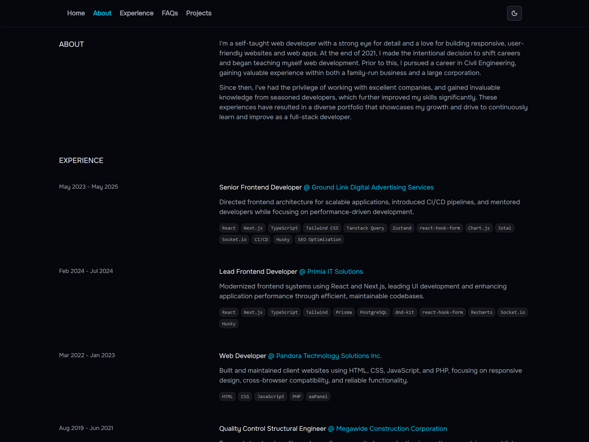
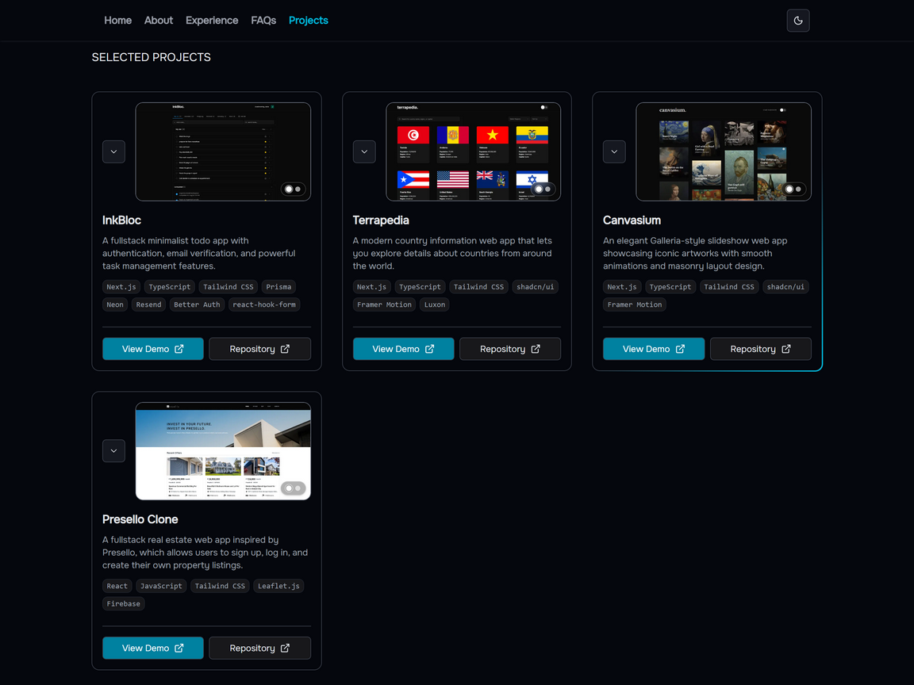

# jobie.dev

My personal portfolio built to showcase my work as a Fullstack Developer.

## 🌐 Live Demo

Explore the site live 👉 [jobie.dev](https://jobie.dev)

## 🛠 Tech Stack

| Tech Stack                                      | Description                               |
| :---------------------------------------------- | :---------------------------------------- |
| [Next.js](https://nextjs.org/)                  | React framework with SSR support          |
| [TypeScript](https://www.typescriptlang.org/)   | Strongly typed JavaScript                 |
| [Tailwind CSS](https://tailwindcss.com/)        | Utility-first styling                     |
| [shadcn/ui](https://ui.shadcn.com/)             | Accessible and customizable UI components |
| [Framer Motion](https://www.framer.com/motion/) | Smooth animations and transitions         |

## 📷 Screenshots

